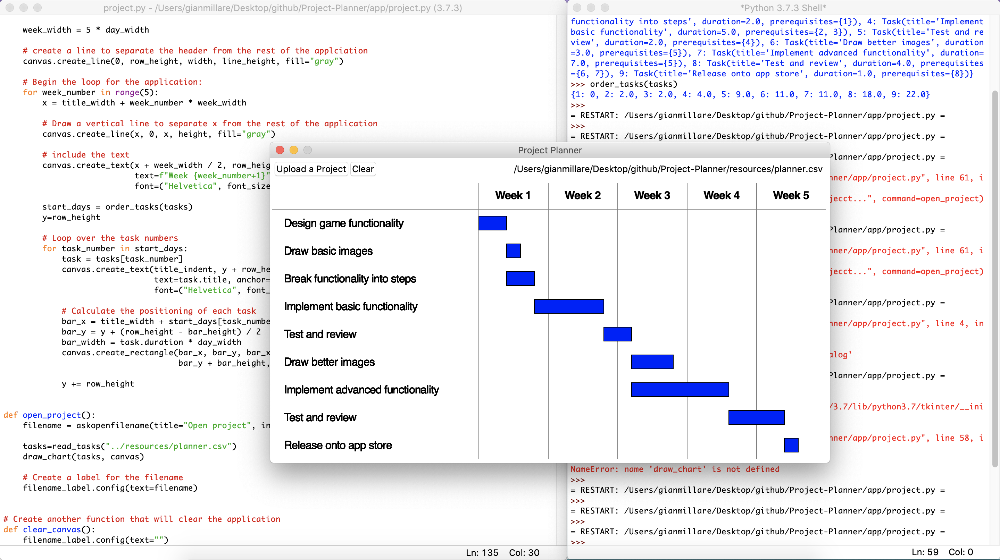

# Project-Planner
------------------------------------------------------------------------------------------

This mini-project is from "Beginner's Step-by-Step Coding Course", written by DK Pub. This is a continuation of my career in software development and programming, following my graduation and certification from UC Berkeley's Data Analytics Extension Program. Although the difficulty of this project is rated intermediate, I felt that this project can help hone some of the fundamentals of programming in Python.

This is a couple of difficulties higher than my previous mini-project titled "Team_Allocator". This project focuses on using Python to create an interactive planner that reads a CSV file to display the length and priority of a specific task.

------------------------------------------------------------------------------------------

------------------------------------------------------------------------------------------
